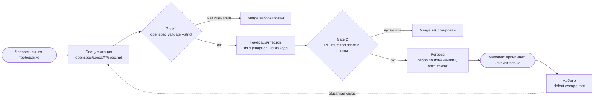

# AI-native QA Demo: уверенность вместо количества тестов

Демо к докладу «AI-native тестирование: почему сгенерированный тест по умолчанию не знает, что такое „правильно“» (AI BOOST '26).

**Нам не хватало не тестов, нам не хватало уверенности.** Здесь спецификация становится оракулом для сгенерированных тестов, каждый гейт в CI блокирует merge, а вместо «N passed» в PR приходят три метрики: mutation score, покрытие требований и defect escape rate.

Архитектура: [architecture_java.md](architecture_java.md) (реализована в этом репозитории), [architecture_python.md](architecture_python.md) (тот же контур на Python / pytest / Poetry / Podman).

## Контур



## Что нужно

- JDK 17 и Maven 3.9+
- Node 20+ и OpenSpec: `npm install -g @fission-ai/openspec@1.13.0`
- Python 3.11+ (только стандартная библиотека)

Без локальной Java можно запускать Maven в контейнере:

```bash
podman run --rm -v m2:/root/.m2 -v "$PWD":/w -w /w \
  docker.io/library/maven:3.9-eclipse-temurin-17 mvn -B test
```

## Демо-ветки

| Ветка | Состояние | Ожидаемый результат CI |
|---|---|---|
| `demo/a-b` | Дефекты в коде, есть оба набора тестов | `from-code` зелёный, `tests` красный |
| `main` | Дефекты исправлены | Все гейты зелёные, отчёт с тремя метриками |
| `demo/c` | Требование без сценария | `gate-1-spec` красный |
| `demo/d` | Расплывчатый сценарий AUTH-LOCK-03 | Агент задаёт вопрос, тест не генерируется |
| `demo/e` | Тесты-пустышки вместо тестов из спеки | `gate-2-mutation` красный при 100% line coverage |

## Сценарии и команды

| # | Сценарий | Ветка | Команда |
|---|---|---|---|
| A | Тест из кода защищает баг | `demo/a-b` | `mvn -B test -Pdemo-from-code` (зелёный) |
| B | Тест из спеки ловит баг | `demo/a-b` | `mvn -B test` (красный: TXT-EQ-01, AUTH-LOCK-01) |
| C | Требование без сценария не проходит CI | `demo/c` | `openspec validate --all --strict --no-interactive` |
| D | Агент находит неоднозначность | `demo/d` | промпт из [prompts/generate-from-spec.md](prompts/generate-from-spec.md) для `openspec/changes/add-lockout-reset` |
| E | Mutation-гейт отсекает пустышки | `demo/e` | `mvn -B test org.pitest:pitest-maven:mutationCoverage` |
| F | Бенчмарк на своих дефектах | `main` | `scripts/benchmark.sh` и `scripts/benchmark.sh --suite from-code` |
| G | Отчёт о качестве | `main` | `mvn -B test org.pitest:pitest-maven:mutationCoverage && python3 scripts/quality_report.py` |

Гейты по отдельности:

```bash
openspec validate --all --strict --no-interactive                # Gate 1
mvn -B test                                                      # тесты из спеки
mvn -B test-compile org.pitest:pitest-maven:mutationCoverage     # Gate 2, порог 80
python3 scripts/req_coverage.py --min 100                        # покрытие требований
```

Замер на `main` (maven:3.9-eclipse-temurin-17): mutation score 94% (17/18), покрытие требований 100% (6/6), бенчмарк `from-spec: caught 8 of 10`, `from-code: caught 2 of 10`. Числа зависят от модели и промпта, которыми сгенерированы тесты: в докладе важен способ измерения, а не процент.

## История и теги

Коммиты в формате [Conventional Commits](https://www.conventionalcommits.org/). Каждый шаг из раздела 6 архитектуры отмечен аннотированным тегом, по нему можно открыть состояние репозитория на этом шаге:

| Тег | Шаг |
|---|---|
| `step-00` | OpenSpec инициализирован |
| `step-01` | `AGENTS.md`, контекст проекта |
| `step-02` | `pom.xml`: JUnit 5, JaCoCo, PIT |
| `step-03` | Спецификации |
| `step-04` | Код с дефектами |
| `step-05` | Антипример: тесты из кода |
| `step-06` | Тесты из спеки поймали дефекты, дефекты исправлены |
| `step-07` | Тесты-пустышки (ветка `demo/e`) |
| `step-08` | Корректная дельта требования |
| `step-09` | Расплывчатый сценарий (ветка `demo/d`) |
| `step-10` | Покрытие требований и отчёт о качестве |
| `step-11` | CI-гейты и чеклист ревью |
| `step-12` | Бенчмарк |
| `step-13` | README |
| `v1.0.0` | Демо готово |

```bash
git checkout step-06   # пример: состояние после шага 6
```

## Настройка GitHub

В Settings → Branches → `main` включить «Require status checks to pass» и отметить `gate-1-spec`, `tests`, `gate-2-mutation`, `req-coverage`. После этого PR из `demo/c` и `demo/e` не мержатся.

## Ограничения

- Исследования качества сгенерированных тестов выполнены в основном на Java-юнит-тестах (Defects4J); результаты не переносятся напрямую на E2E и другой стек.
- `metrics/escaped_defects.csv` заполнен вручную демо-данными; в реальном проекте источник — трекер инцидентов.

## Источники

- Zhao, Zhou, Cohen, arXiv:2607.22880, 2026 (Defects4J); arXiv:2603.23443, 2026
- DORA, State of AI-assisted Software Development, 2025
- World Quality Report 2025
- METR, arXiv:2507.09089, 2025
- OpenSpec: https://github.com/Fission-AI/OpenSpec
- PIT Mutation Testing: https://pitest.org
