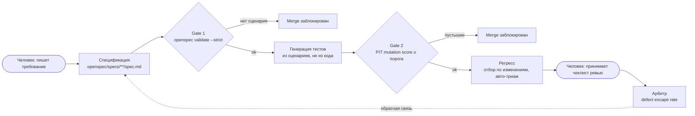

# AI-native QA Demo: уверенность вместо количества тестов

Демо-репозиторий к докладу «AI-native тестирование: почему сгенерированный тест по умолчанию не знает, что такое „правильно“» (AI BOOST '26).

> **Тезис (слайд 4):** нам не хватало не тестов, нам не хватало уверенности.
> Генерация тестов лечит первый дефицит. Демо показывает, как закрыть второй: спецификация становится оракулом, каждый гейт в CI блокирует, а на выходе вместо числа тестов три метрики (mutation score, покрытие требований, defect escape rate).

---

## 1. Что показывает демо

| # | Сценарий демо | Что видит зритель | Слайд |
|---|---|---|---|
| A | **Тест из кода защищает баг** | AI пишет тест по реализации `equals` с дефектом, CI зелёный, покрытие растёт, баг записан как «норма» | 3 |
| B | **Тест из спеки ловит баг** | Тот же метод, но тест сгенерирован из сценария спецификации: сборка красная, дефект найден | 9 |
| C | **Требование без сценария не проходит CI** | PR с изменённым требованием без `Scenario` блокируется `openspec validate --strict` | 10 |
| D | **Агент находит неоднозначность** | Расплывчатый сценарий, агент задаёт вопрос до написания кода, человек правит спеку | 11 |
| E | **Mutation-гейт отсекает тесты-пустышки** | Покрытие 90%+, mutation score низкий, Gate 2 падает | 14, 15 |
| F | **Бенчмарк на своих дефектах** | Откатываем 10 фиксов, генерируем тесты по требованиям, считаем пойманные | 15, 19 |
| G | **Отчёт о качестве вместо числа тестов** | В PR-комментарии три метрики, а не «3000 passed» | 14, 17 |

---

## 2. Целевой контур (слайд 17)



Правило: каждая стрелка машинная, каждый гейт блокирует, обе точки входа человеческие.

---

## 3. Технологический стек

| Слой | Инструмент | Зачем |
|---|---|---|
| Язык и сборка | Java 17, Maven | Совпадает с примером Defects4J (Lang-14) на слайде 3 |
| Тесты | JUnit 5 | Юнит-тесты, тегирование по ID сценария |
| Спецификации | OpenSpec (`@fission-ai/openspec`, Node 20+) | Спека как оракул, дельты требований, `validate --strict` |
| Mutation testing | PIT (`pitest-maven` + `pitest-junit5-plugin`) | Gate 2, mutation score |
| Покрытие | JaCoCo | Чтобы показать разрыв «покрытие высокое, mutation score низкий» |
| CI | GitHub Actions | Гейты как обязательные status checks |
| Отчёт | Python 3.11 скрипт | Покрытие требований, сводка метрик в PR |
| Агент | Claude Code / Copilot / Cursor (любой) | Генерация тестов по промптам из раздела 6 |

Подход не привязан к OpenSpec: вместо него можно взять Spec Kit, Kiro или BMAD. Структура гейтов не меняется.

---

## 4. Структура репозитория

```text
ai-native-qa-demo/
├── README.md                         # Краткое описание и как запустить демо
├── architecture_java.md              # Этот документ
├── AGENTS.md                         # Правила для AI-агента (оракул = спека)
├── CLAUDE.md                         # Импортирует AGENTS.md для Claude Code
├── pom.xml                           # JUnit 5, JaCoCo, PIT с mutationThreshold
│
├── openspec/
│   ├── config.yaml                   # Конфиг OpenSpec 1.x (context для агента)
│   ├── project.md                    # Контекст проекта для агента
│   ├── specs/                        # Источник истины: текущие требования
│   │   ├── text-equality/spec.md     # Сравнение строк (сценарии A, B, E)
│   │   └── auth-lockout/spec.md      # Блокировка аккаунта (сценарии C, D)
│   └── changes/                      # Дельты требований в PR
│       ├── add-lockout-reset/        # Пример корректной дельты
│       │   ├── proposal.md
│       │   ├── tasks.md
│       │   └── specs/auth-lockout/spec.md
│       └── broken-no-scenario/       # Ветка demo/c: требование без сценария
│
├── src/main/java/demo/
│   ├── text/TextUtils.java           # equals() с дефектом equalsIgnoreCase
│   └── auth/
│       ├── LoginResult.java          # SUCCESS / FAILURE / LOCKED
│       └── LoginService.java         # Счётчик неудачных входов, блокировка
│
├── src/test/java/demo/
│   ├── fromcode/                     # Тесты, сгенерированные ИЗ КОДА (антипример)
│   │   └── TextUtilsFromCodeTest.java
│   └── fromspec/                     # Тесты, сгенерированные ИЗ СПЕКИ
│       ├── TextEqualitySpecTest.java
│       └── AuthLockoutSpecTest.java
│
├── benchmark/
│   ├── defects/                      # 10 патчей, каждый возвращает дефект
│   │   ├── D01-equals-ignore-case.patch
│   │   ├── ...
│   │   └── D10-off-by-one-lockout.patch
│   └── defects.csv                   # id, модуль, требование, описание
│
├── scripts/
│   ├── benchmark.sh                  # Откат фиксов → прогон тестов из спеки → счёт
│   ├── req_coverage.py               # Сценарии с тестом / все сценарии
│   └── quality_report.py             # Сводка трёх метрик в Markdown для PR
│
├── metrics/
│   └── escaped_defects.csv           # Дефекты, дошедшие до прода (для арбитра)
│
├── prompts/
│   ├── generate-from-code.md         # Антипример: промпт с исходным кодом
│   ├── generate-from-spec.md         # Правильный промпт: только сценарии
│   └── review-checklist.md           # Чеклист, который принимает человек
│
└── .github/
    ├── workflows/quality-gates.yml   # Gate 1, тесты, Gate 2, отчёт
    └── pull_request_template.md      # Чеклист ревьюера (агент не ставит галочки)
```

---

## 5. Ключевые компоненты

### 5.1. Спецификация как оракул

Формат OpenSpec: каждое требование содержит `SHALL`/`MUST` и минимум один сценарий. ID сценария стоит в заголовке, по нему тесты связываются с требованием.

```markdown
# text-equality

## Requirements

### Requirement: Case-sensitive equality
The system SHALL treat two strings as equal only if they contain
the same characters in the same case.

#### Scenario: TXT-EQ-01 different case is not equal
- **WHEN** comparing "ABC" and "abc"
- **THEN** the result is false

#### Scenario: TXT-EQ-02 both null are equal
- **WHEN** comparing null and null
- **THEN** the result is true

#### Scenario: TXT-EQ-03 null and non-null are not equal
- **WHEN** comparing null and "abc"
- **THEN** the result is false

#### Scenario: TXT-EQ-04 same characters in the same case are equal
- **WHEN** comparing two separate string instances "abc" and "abc"
- **THEN** the result is true
```

TXT-EQ-04 нужен Gate 2: без позитивного сценария ветка `return a.equals(b)` не имеет оракула, и мутант «вернуть false» выживает.

```markdown
# auth-lockout

## Requirements

### Requirement: Account lockout
The system SHALL lock the account after 5 failed logins.

#### Scenario: AUTH-LOCK-01 lockout on sixth attempt
- **GIVEN** 5 failed logins
- **WHEN** a 6th attempt is made
- **THEN** the account is locked

#### Scenario: AUTH-LOCK-02 successful login resets counter
- **GIVEN** 4 failed logins
- **WHEN** a successful login is made
- **THEN** the failed-login counter is reset to 0
```

### 5.2. Реализация с дефектом (слайд 3)

```java
public static boolean equals(String a, String b) {
    if (a == b) return true;
    if (a == null || b == null) return false;
    return a.equalsIgnoreCase(b); // BUG: спека требует учитывать регистр
}
```

### 5.3. Два набора тестов

- `fromcode/`: тест, который агент пишет по реализации. Он проверяет `assertTrue(equals("ABC", "abc"))`, проходит и закрепляет дефект. Набор помечен `@Tag("from-code")` и **исключён из CI по умолчанию**: запускается только в демо-профиле `-Pdemo-from-code`.
- `fromspec/`: тесты из сценариев. Каждый метод помечен `@Tag("<ID сценария>")`, например `@Tag("TXT-EQ-01")`. По этим тегам `req_coverage.py` считает покрытие требований.

### 5.4. Гейты CI (`.github/workflows/quality-gates.yml`)

| Job | Команда | Блокирует, если |
|---|---|---|
| `gate-1-spec` | `openspec validate --all --strict --no-interactive` | Требование без сценария, нарушен формат дельты |
| `tests` | `mvn -B test` | Падает тест из спеки |
| `gate-2-mutation` | `mvn -B test-compile org.pitest:pitest-maven:mutationCoverage` | Mutation score ниже `mutationThreshold` (по умолчанию 80) |
| `req-coverage` | `python scripts/req_coverage.py --min 100` | Сценарий из спеки без теста |
| `report` | `python scripts/quality_report.py >> $GITHUB_STEP_SUMMARY` | Не блокирует, публикует сводку в PR |

Все блокирующие job добавляются в обязательные status checks ветки `main`.

### 5.5. Отчёт о качестве (слайд 14)

`quality_report.py` собирает в один Markdown-блок:

1. **Mutation score** из `target/pit-reports/mutations.xml` (убитые / все мутанты).
2. **Покрытие требований**: сценарии с тестом / все сценарии в `openspec/specs`.
3. **Defect escape rate** из `metrics/escaped_defects.csv` (дефекты в проде / все найденные за период).
4. Для контраста: line coverage из JaCoCo и число тестов, с пометкой «не является аргументом».

### 5.6. Бенчмарк на своих дефектах (слайды 15, 19)

`scripts/benchmark.sh`:

1. Для каждого патча из `benchmark/defects/` создаёт чистую копию, применяет патч (дефект возвращается).
2. Запускает только `fromspec`-тесты.
3. Пишет в `benchmark/results.csv`: `defect_id, caught (yes/no), failing_tests`.
4. Печатает итог: «Поймано N из 10».

Повторный запуск с набором `fromcode` даёт контраст: тесты из кода ловят меньше.

---

## 6. Шаги по генерации файлов

Каждый шаг: что создать, промпт для агента и критерий готовности. Шаги выполняются по порядку, после каждого делается коммит.

### Шаг 0. Подготовка

```bash
mkdir ai-native-qa-demo && cd ai-native-qa-demo
git init
npm install -g @fission-ai/openspec@latest
openspec init          # выбрать своего AI-ассистента в мастере
```

**Готово, когда:** есть каталог `openspec/` с `project.md`, `specs/`, `changes/`.

### Шаг 1. Правила для агента: `AGENTS.md` и `openspec/project.md`

**Промпт:**
```text
Создай AGENTS.md для Java 17 / Maven / JUnit 5 проекта.
Главное правило: оракул для тестов берётся ТОЛЬКО из openspec/specs/**/spec.md.
Исходный код можно читать только чтобы узнать сигнатуры и точки подключения,
но не ожидаемое поведение. Каждый тест помечается @Tag с ID сценария
(например TXT-EQ-01). Если сценарий неоднозначен, остановись и задай вопрос
вместо того, чтобы угадывать. Агент не отмечает пункты чеклиста ревью.
Также заполни openspec/project.md: назначение демо, стек, соглашения.
```

**Готово, когда:** в `AGENTS.md` явно записаны правило оракула, правило тегов и запрет на угадывание.

### Шаг 2. Сборка: `pom.xml`

**Промпт:**
```text
Создай pom.xml: Java 17, JUnit Jupiter 5.10+, maven-surefire-plugin,
jacoco-maven-plugin (отчёт в target/site/jacoco), pitest-maven с
pitest-junit5-plugin, targetClasses demo.*, targetTests demo.fromspec.*,
mutationThreshold 80, outputFormats XML и HTML, timestampedReports false.
По умолчанию surefire исключает тег "from-code".
Добавь профиль demo-from-code, который запускает только тег "from-code".
```

**Готово, когда:** `mvn -B verify` проходит на пустом проекте.

### Шаг 3. Спецификации

Создать вручную (это работа человека, точка входа №1) `openspec/specs/text-equality/spec.md` и `openspec/specs/auth-lockout/spec.md` по образцу из раздела 5.1.

```bash
openspec validate --strict
```

**Готово, когда:** валидация проходит, у каждого требования есть сценарий с ID.

### Шаг 4. Код с дефектами

**Промпт:**
```text
Создай src/main/java/demo/text/TextUtils.java со статическим методом
equals(String a, String b) ровно в таком виде (с дефектом equalsIgnoreCase):
[вставить код из раздела 5.2].
Создай src/main/java/demo/auth/LoginService.java: метод login(user, password)
возвращает SUCCESS / FAILURE / LOCKED, хранит счётчик неудачных попыток
в памяти. Внеси дефект: блокировка после 6 неудач вместо 5 (off-by-one).
Не пиши тесты.
```

**Готово, когда:** код компилируется, тестов нет.

### Шаг 5. Антипример: тесты из кода (сценарий A)

Используется `prompts/generate-from-code.md`: в промпт передаётся **исходный код** класса.

**Промпт:**
```text
Вот класс TextUtils: [вставить код]. Напиши JUnit 5 тесты, которые
обеспечат 100% покрытие. Положи в src/test/java/demo/fromcode/,
пометь класс @Tag("from-code").
```

```bash
mvn -B test -Pdemo-from-code   # зелёный: дефект закреплён тестом
```

**Готово, когда:** тесты зелёные и среди них есть ассерт, подтверждающий `equals("ABC","abc") == true`. Это и есть демонстрация слайда 3.

### Шаг 6. Тесты из спеки (сценарий B)

Используется `prompts/generate-from-spec.md`: в промпт идут **только сценарии** и сигнатуры.

**Промпт:**
```text
Вот сценарии из openspec/specs/text-equality/spec.md и
openspec/specs/auth-lockout/spec.md: [вставить]. Вот сигнатуры:
TextUtils.equals(String, String): boolean;
LoginService(Map<String, String> passwords);
LoginService.login(String, String): LoginResult;
LoginService.isLocked(String): boolean;
LoginService.failedAttempts(String): int.
Для каждого сценария напиши один JUnit 5 тест в src/test/java/demo/fromspec/,
пометь его @Tag("<ID сценария>"), в @DisplayName продублируй название
сценария. Ожидаемые значения бери только из THEN. Код реализации не читай.
```

```bash
mvn -B test   # красный: TXT-EQ-01 и AUTH-LOCK-01 падают
```

**Готово, когда:** падают ровно тесты, соответствующие внесённым дефектам. После этого дефекты чинятся отдельным коммитом, сборка зеленеет.

### Шаг 7. Тесты-пустышки для mutation-гейта (сценарий E)

**Промпт:**
```text
В ветке demo/e замени тесты из спеки на src/test/java/demo/fromspec/WeakCoverageTest.java:
тесты вызывают все методы TextUtils и LoginService, но проверяют только
отсутствие исключений (без содержательных assert). Теги сценариев оставь.
Цель: высокое line coverage при низком mutation score.
```

Тесты из спеки удаляются: если оставить их рядом, они убивают мутантов и Gate 2 остаётся зелёным. Теги сценариев сохранены, поэтому `req-coverage` зелёный: покрытие требований по тегам тоже можно «накрутить», ловит это только mutation score.

```bash
git checkout -b demo/e
mvn -B test jacoco:report org.pitest:pitest-maven:mutationCoverage
```

**Готово, когда:** JaCoCo показывает высокое покрытие, а PIT падает по `mutationThreshold`.

### Шаг 8. Дельта требования и Gate 1 (сценарий C)

Корректная дельта (`openspec/changes/add-lockout-reset/specs/auth-lockout/spec.md`):

```markdown
## MODIFIED Requirements

### Requirement: Account lockout
The system SHALL lock the account after 5 failed logins
and SHALL unlock it after 15 minutes.

#### Scenario: AUTH-LOCK-01 lockout on sixth attempt
- **GIVEN** 5 failed logins
- **WHEN** a 6th attempt is made
- **THEN** the account is locked

#### Scenario: AUTH-LOCK-03 unlock after timeout
- **GIVEN** a locked account
- **WHEN** 15 minutes have passed
- **THEN** the user can log in again
```

Сломанная дельта (ветка `demo/c`, `openspec/changes/broken-no-scenario/`): то же требование **без** блока `#### Scenario`.

```bash
openspec validate add-lockout-reset --strict    # ok
openspec validate broken-no-scenario --strict   # fail → merge заблокирован
```

**Готово, когда:** PR из `demo/c` красный на job `gate-1-spec`.

### Шаг 9. Неоднозначность (сценарий D, слайд 11)

В ветке `demo/d` заменить AUTH-LOCK-03 на расплывчатый сценарий:

```markdown
#### Scenario: AUTH-LOCK-03 unlock after a while
- **GIVEN** a locked account
- **WHEN** some time has passed
- **THEN** the user can usually log in again
```

Запустить промпт из шага 6. Ожидаемое поведение агента по правилам `AGENTS.md`: он **не пишет тест**, а спрашивает, сколько времени и что значит «usually». Человек правит спеку, агент генерирует тесты и запускает `validate --strict`.

**Готово, когда:** записан диалог агента с вопросом (лог или скринкаст для слайда 11), PR содержит дельту спеки и тесты рядом.

### Шаг 10. Покрытие требований и отчёт

**Промпт:**
```text
Напиши scripts/req_coverage.py: парсит openspec/specs/**/spec.md, извлекает
ID из строк "#### Scenario: <ID> ...", ищет @Tag("<ID>") в src/test/java/demo/fromspec.
Выводит таблицу ID / есть тест, итоговый процент, флаг --min N
(exit 1, если ниже N).
Напиши scripts/quality_report.py: читает target/pit-reports/mutations.xml,
target/site/jacoco/jacoco.csv, вывод req_coverage.py и
metrics/escaped_defects.csv (колонки: id, found_at [test|prod], date).
Печатает Markdown: три главные метрики сверху, line coverage и число тестов
ниже с пометкой «не является аргументом».
```

**Готово, когда:** `python scripts/quality_report.py` печатает таблицу с тремя метриками.

### Шаг 11. CI: `.github/workflows/quality-gates.yml`

**Промпт:**
```text
Создай GitHub Actions workflow на pull_request и push в main.
Jobs: gate-1-spec (setup-node 20, npm i -g @fission-ai/openspec,
openspec validate --strict), tests (setup-java 17 temurin, mvn -B test),
gate-2-mutation (needs tests, PIT mutationCoverage),
req-coverage (python scripts/req_coverage.py --min 100),
report (needs все предыдущие, if: always(), пишет quality_report.py
в $GITHUB_STEP_SUMMARY). Сохрани PIT и JaCoCo отчёты как artifacts.
```

Плюс `.github/pull_request_template.md` с чеклистом ревьюера из `prompts/review-checklist.md`: сценарии соответствуют намерению, тесты проверяют THEN, а не реализацию, mutation score не упал, нет тестов из кода в `fromspec/`.

**Готово, когда:** в настройках ветки `main` гейты отмечены как required, PR из `demo/c` и `demo/e` блокируются.

### Шаг 12. Бенчмарк (сценарий F)

**Промпт:**
```text
Создай 10 патчей в benchmark/defects/, каждый возвращает один дефект в
TextUtils или LoginService (equalsIgnoreCase, off-by-one в счётчике,
сброс счётчика не происходит, null-обработка, блокировка не снимается и т.д.).
Опиши их в benchmark/defects.csv (id, module, requirement_id, description).
Напиши scripts/benchmark.sh: для каждого патча — git worktree во временный
каталог, git apply, mvn -q test -Dgroups=<все теги сценариев>,
запись результата в benchmark/results.csv, итог "Caught N of 10".
Флаг --suite from-code прогоняет набор из кода для сравнения.
```

**Готово, когда:** скрипт печатает две строки, например `from-spec: caught 9 of 10` и `from-code: caught 3 of 10` (фактические числа зависят от сгенерированных тестов).

### Шаг 13. README и сценарий показа

**Промпт:**
```text
Напиши README.md: одна фраза о тезисе «уверенность вместо количества тестов»,
схема контура (mermaid из ARCHITECTURE.md), таблица демо-веток
(main, demo/c, demo/d, demo/e), команды запуска каждого сценария,
ссылки на источники из доклада.
```

---

## 7. Демо-ветки

| Ветка | Состояние | Ожидаемый результат CI |
|---|---|---|
| `demo/a-b` | Дефекты в коде, есть оба набора тестов | `from-code` зелёный, `fromspec` красный |
| `main` | Дефекты исправлены | Все гейты зелёные, отчёт с тремя метриками |
| `demo/c` | Требование без сценария | `gate-1-spec` красный |
| `demo/d` | Расплывчатый сценарий | Агент задаёт вопрос, тест не генерируется |
| `demo/e` | Тесты-пустышки | `gate-2-mutation` красный при высоком покрытии |

---

## 8. Сценарий показа (5–7 минут)

1. `demo/a-b`: показать тест из кода и зелёный прогон. «CI зелёный, покрытие выросло, баг защищён».
2. Там же: тесты из спеки, красный прогон. «Оракул пришёл из спецификации, а не из кода».
3. `demo/c`: PR без сценария, красный Gate 1.
4. `demo/d`: запись диалога, агент спрашивает до написания кода.
5. `demo/e`: покрытие 90%+, mutation score низкий, Gate 2 красный.
6. `scripts/benchmark.sh`: «поймано N из 10» для двух наборов.
7. `main`: отчёт в PR с тремя метриками вместо «N passed».

---

## 9. Ограничения

- Исследования качества сгенерированных тестов выполнены в основном на Java-юнит-тестах (Defects4J). Результаты демо не переносятся напрямую на E2E и другой стек.
- Числа в бенчмарке зависят от модели и промпта. В докладе показываем способ измерения, а не конкретный процент.
- `escaped_defects.csv` в демо заполнен вручную: в реальном проекте источник — трекер инцидентов.

## 10. Источники

- Zhao, Zhou, Cohen, arXiv:2607.22880, 2026 (Defects4J); arXiv:2603.23443, 2026
- DORA, State of AI-assisted Software Development, 2025
- World Quality Report 2025
- METR, arXiv:2507.09089, 2025
- OpenSpec: https://github.com/Fission-AI/OpenSpec
- PIT Mutation Testing: https://pitest.org
