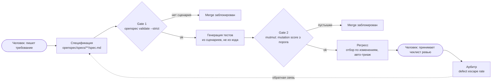

# AI-native QA Demo: уверенность вместо количества тестов

Демо-репозиторий к докладу «AI-native тестирование: почему сгенерированный тест по умолчанию не знает, что такое „правильно“» (AI BOOST '26).

> **Тезис (слайд 4):** нам не хватало не тестов, нам не хватало уверенности.
> Генерация тестов лечит первый дефицит. Демо показывает, как закрыть второй: спецификация становится оракулом, каждый гейт в CI блокирует, а на выходе вместо числа тестов три метрики (mutation score, покрытие требований, defect escape rate).

---

## 1. Что показывает демо

| # | Сценарий демо | Что видит зритель | Слайд |
|---|---|---|---|
| A | **Тест из кода защищает баг** | AI пишет тест по реализации `equals` с дефектом, CI зелёный, покрытие растёт, баг записан как «норма» | 3 |
| B | **Тест из спеки ловит баг** | Тот же метод, но тест сгенерирован из сценария спецификации: сборка красная, дефект найден | 9 |
| C | **Требование без сценария не проходит CI** | PR с изменённым требованием без `Scenario` блокируется `openspec validate --strict` | 10 |
| D | **Агент находит неоднозначность** | Расплывчатый сценарий, агент задаёт вопрос до написания кода, человек правит спеку | 11 |
| E | **Mutation-гейт отсекает тесты-пустышки** | Покрытие 90%+, mutation score низкий, Gate 2 падает | 14, 15 |
| F | **Бенчмарк на своих дефектах** | Откатываем 10 фиксов, генерируем тесты по требованиям, считаем пойманные | 15, 19 |
| G | **Отчёт о качестве вместо числа тестов** | В PR-комментарии три метрики, а не «3000 passed» | 14, 17 |

---

## 2. Целевой контур (слайд 17)



Правило: каждая стрелка машинная, каждый гейт блокирует, обе точки входа человеческие.

---

## 3. Технологический стек

| Слой | Инструмент | Зачем |
|---|---|---|
| Язык | Python 3.12 | Пример Defects4J Lang-14 (слайд 3) перенесён на Python один в один |
| Зависимости | Poetry 2 (`pyproject.toml`, `poetry.lock`, `package-mode = false`) | Фиксированные версии инструментов, одинаковые локально и в CI |
| Окружение | Podman (rootless), `Containerfile` | Один образ: Python, Poetry, Node 20, OpenSpec, git. Все гейты запускаются только в нём |
| Тесты | pytest | Юнит-тесты, маркер `scenario("<ID>")` связывает тест со сценарием |
| Спецификации | OpenSpec (`@fission-ai/openspec`, Node 20+ внутри образа) | Спека как оракул, дельты требований, `validate --strict` |
| Mutation testing | mutmut 3 + `scripts/mutation_gate.py` | Gate 2, mutation score и порог (у mutmut нет встроенного порога) |
| Покрытие | pytest-cov (coverage.py) | Чтобы показать разрыв «покрытие высокое, mutation score низкий» |
| CI | GitHub Actions, job'ы вызывают `podman` | Гейты как обязательные status checks |
| Отчёт | Python-скрипты в том же образе | Покрытие требований, сводка метрик в PR |
| Агент | Claude Code / Copilot / Cursor (любой) | Генерация тестов по промптам из раздела 6 |

Подход не привязан к OpenSpec: вместо него можно взять Spec Kit, Kiro или BMAD. Структура гейтов не меняется.

На хосте нужны только Podman 4+ (на macOS/Windows с `podman machine`) и Poetry 2 для `poetry lock`. Всё остальное живёт в образе.

---

## 4. Структура репозитория

```text
ai-native-qa-demo/
├── README.md                         # Краткое описание и как запустить демо
├── ARCHITECTURE.md                   # Этот документ
├── AGENTS.md                         # Правила для AI-агента (оракул = спека)
├── pyproject.toml                    # Poetry, настройки pytest, coverage, mutmut
├── poetry.lock
├── Containerfile                     # Python 3.12 + Poetry + Node 20 + OpenSpec + git
├── .containerignore
├── .gitignore                        # reports/, mutants/, .venv/
│
├── openspec/
│   ├── project.md                    # Контекст проекта для агента
│   ├── specs/                        # Источник истины: текущие требования
│   │   ├── text-equality/spec.md     # Сравнение строк (сценарии A, B, E)
│   │   └── auth-lockout/spec.md      # Блокировка аккаунта (сценарии C, D)
│   └── changes/                      # Дельты требований в PR
│       ├── add-lockout-reset/        # Пример корректной дельты
│       │   ├── proposal.md
│       │   ├── tasks.md
│       │   └── specs/auth-lockout/spec.md
│       └── broken-no-scenario/       # Ветка demo/c: требование без сценария
│
├── src/demo/
│   ├── __init__.py
│   ├── text/
│   │   ├── __init__.py
│   │   └── text_utils.py             # equals() с дефектом casefold
│   └── auth/
│       ├── __init__.py
│       └── login_service.py          # Счётчик неудачных входов, блокировка
│
├── tests/
│   ├── fromcode/                     # Тесты, сгенерированные ИЗ КОДА (антипример)
│   │   └── test_text_utils_from_code.py
│   └── fromspec/                     # Тесты, сгенерированные ИЗ СПЕКИ
│       ├── test_text_equality_spec.py
│       └── test_auth_lockout_spec.py
│
├── benchmark/
│   ├── defects/                      # 10 патчей, каждый возвращает дефект
│   │   ├── D01-equals-ignore-case.patch
│   │   ├── ...
│   │   └── D10-off-by-one-lockout.patch
│   └── defects.csv                   # id, модуль, требование, описание
│
├── scripts/
│   ├── qa.sh                         # Обёртка: podman run ... poetry run "$@"
│   ├── benchmark.sh                  # Откат фиксов → прогон тестов из спеки → счёт
│   ├── mutation_gate.py              # Mutation score из mutmut, порог --min N
│   ├── req_coverage.py               # Сценарии с тестом / все сценарии
│   └── quality_report.py             # Сводка трёх метрик в Markdown для PR
│
├── metrics/
│   └── escaped_defects.csv           # Дефекты, дошедшие до прода (для арбитра)
│
├── prompts/
│   ├── generate-from-code.md         # Антипример: промпт с исходным кодом
│   ├── generate-from-spec.md         # Правильный промпт: только сценарии
│   └── review-checklist.md           # Чеклист, который принимает человек
│
└── .github/
    ├── workflows/quality-gates.yml   # Образ, Gate 1, тесты, Gate 2, отчёт
    └── pull_request_template.md      # Чеклист ревьюера (агент не ставит галочки)
```

Генерируемые каталоги (не коммитятся): `reports/` (coverage, junit), `mutants/` (рабочая копия и статистика mutmut).

---

## 5. Ключевые компоненты

### 5.1. Спецификация как оракул

Формат OpenSpec: каждое требование содержит `SHALL`/`MUST` и минимум один сценарий. ID сценария стоит в заголовке, по нему тесты связываются с требованием.

```markdown
# text-equality

## Requirements

### Requirement: Case-sensitive equality
The system SHALL treat two strings as equal only if they contain
the same characters in the same case.

#### Scenario: TXT-EQ-01 different case is not equal
- **WHEN** comparing "ABC" and "abc"
- **THEN** the result is false

#### Scenario: TXT-EQ-02 both null are equal
- **WHEN** comparing null and null
- **THEN** the result is true

#### Scenario: TXT-EQ-03 null and non-null are not equal
- **WHEN** comparing null and "abc"
- **THEN** the result is false
```

```markdown
# auth-lockout

## Requirements

### Requirement: Account lockout
The system SHALL lock the account after 5 failed logins.

#### Scenario: AUTH-LOCK-01 lockout on sixth attempt
- **GIVEN** 5 failed logins
- **WHEN** a 6th attempt is made
- **THEN** the account is locked

#### Scenario: AUTH-LOCK-02 successful login resets counter
- **GIVEN** 4 failed logins
- **WHEN** a successful login is made
- **THEN** the failed-login counter is reset to 0
```

`null` в спеке соответствует `None` в Python. Спека остаётся языконезависимой.

### 5.2. Реализация с дефектом (слайд 3)

```python
def equals(a: str | None, b: str | None) -> bool:
    if a is b:
        return True
    if a is None or b is None:
        return False
    return a.casefold() == b.casefold()  # BUG: спека требует учитывать регистр
```

### 5.3. Два набора тестов

- `tests/fromcode/`: тест, который агент пишет по реализации. Он проверяет `assert equals("ABC", "abc")`, проходит и закрепляет дефект. Модуль помечен `pytestmark = pytest.mark.from_code` и **исключён из прогона по умолчанию** (`addopts = -m "not from_code"`): запускается только явно, `pytest -m from_code tests/fromcode`.
- `tests/fromspec/`: тесты из сценариев. Каждый тест помечен `@pytest.mark.scenario("<ID сценария>")`, например `@pytest.mark.scenario("TXT-EQ-01")`. По этим маркерам `req_coverage.py` считает покрытие требований. Маркеры `scenario` и `from_code` зарегистрированы в `pyproject.toml`, включён `--strict-markers`.

### 5.4. Гейты CI (`.github/workflows/quality-gates.yml`)

Каждый job загружает один и тот же образ и выполняет команды через `scripts/qa.sh` (см. 5.7).

| Job | Команда | Блокирует, если |
|---|---|---|
| `image` | `podman build -t ai-native-qa-demo .` + `podman save` в artifact | Образ не собирается, `poetry.lock` не совпадает с `pyproject.toml` |
| `gate-1-spec` | `./scripts/qa.sh openspec validate --strict` | Требование без сценария, нарушен формат дельты |
| `tests` | `./scripts/qa.sh pytest --cov=src --cov-report=xml:reports/coverage.xml --junitxml=reports/junit.xml` | Падает тест из спеки |
| `gate-2-mutation` | `./scripts/qa.sh mutmut run`, `./scripts/qa.sh mutmut export-cicd-stats`, `./scripts/qa.sh python scripts/mutation_gate.py --min 80` | Mutation score ниже порога (по умолчанию 80) |
| `req-coverage` | `./scripts/qa.sh python scripts/req_coverage.py --min 100` | Сценарий из спеки без теста |
| `report` | `./scripts/qa.sh python scripts/quality_report.py >> "$GITHUB_STEP_SUMMARY"` | Не блокирует, публикует сводку в PR |

Все блокирующие job добавляются в обязательные status checks ветки `main`.

### 5.5. Отчёт о качестве (слайд 14)

`quality_report.py` собирает в один Markdown-блок:

1. **Mutation score** из `mutants/mutmut-cicd-stats.json` (убитые / (убитые + выжившие)).
2. **Покрытие требований**: сценарии с тестом / все сценарии в `openspec/specs`.
3. **Defect escape rate** из `metrics/escaped_defects.csv` (дефекты в проде / все найденные за период).
4. Для контраста: line coverage из `reports/coverage.xml` и число тестов из `reports/junit.xml`, с пометкой «не является аргументом».

### 5.6. Бенчмарк на своих дефектах (слайды 15, 19)

`scripts/benchmark.sh` запускается внутри образа: `./scripts/qa.sh bash scripts/benchmark.sh`.

1. Для каждого патча из `benchmark/defects/` делает чистую копию `HEAD` (`git archive HEAD | tar -x -C <tmp>`) и применяет патч (дефект возвращается).
2. В копии запускает только `tests/fromspec`.
3. Пишет в `benchmark/results.csv`: `defect_id, caught (yes/no), failing_tests`.
4. Печатает итог: «Поймано N из 10».

Повторный запуск с `--suite from-code` прогоняет `tests/fromcode` и даёт контраст: тесты из кода ловят меньше.

### 5.7. Контейнерное окружение

`Containerfile`:

- база `docker.io/library/python:3.12-slim`;
- git (нужен бенчмарку), Node 20 (копированием из `docker.io/library/node:20-slim` или из NodeSource), `npm i -g @fission-ai/openspec`;
- Poetry 2, `poetry config virtualenvs.create false`, `poetry install --no-interaction` по `pyproject.toml` и `poetry.lock` (зависимости ставятся в образ, исходники не копируются);
- `git config --global --add safe.directory /app`.

Исходники монтируются в `/app` при запуске, поэтому образ пересобирается только при изменении зависимостей. Код подключается через `pythonpath = ["src"]` в настройках pytest, а не установкой пакета: так копии в бенчмарке и в `mutants/` тестируют свой `src`, а не смонтированный.

`scripts/qa.sh`:

```bash
#!/usr/bin/env bash
set -euo pipefail
IMAGE="${QA_IMAGE:-ai-native-qa-demo}"
TTY=""; if [ -t 0 ] && [ -t 1 ]; then TTY="-it"; fi
exec podman run --rm $TTY -v "$PWD":/app -w /app "$IMAGE" poetry run "$@"
```

На хостах с SELinux (Fedora, RHEL) к монтированию добавляется `:Z`.

---

## 6. Шаги по генерации файлов

Каждый шаг: что создать, промпт для агента и критерий готовности. Шаги выполняются по порядку, после каждого делается коммит. Все команды, кроме `podman build` и `poetry lock`, запускаются через `./scripts/qa.sh`.

### Шаг 0. Подготовка

**Промпт:**
```text
Создай pyproject.toml для Poetry 2: package-mode = false, python ^3.12,
группа dev: pytest, pytest-cov, mutmut 3.
Создай Containerfile по разделу 5.7 ARCHITECTURE.md: python:3.12-slim, git,
Node 20, глобально @fission-ai/openspec, Poetry 2 без virtualenv,
poetry install по pyproject.toml и poetry.lock, safe.directory /app.
Создай .containerignore (.git, .venv, reports, mutants), .gitignore
(reports/, mutants/, .venv/, __pycache__/) и scripts/qa.sh из раздела 5.7.
```

```bash
mkdir ai-native-qa-demo && cd ai-native-qa-demo
git init
# агент создаёт файлы по промпту выше
poetry lock
chmod +x scripts/qa.sh
podman build -t ai-native-qa-demo -f Containerfile .
./scripts/qa.sh openspec init   # выбрать своего AI-ассистента в мастере
```

**Готово, когда:** образ собирается, есть каталог `openspec/` с `project.md`, `specs/`, `changes/`.

### Шаг 1. Правила для агента: `AGENTS.md` и `openspec/project.md`

**Промпт:**
```text
Создай AGENTS.md для Python 3.12 / Poetry / pytest проекта, который
запускается только в контейнере Podman через ./scripts/qa.sh.
Главное правило: оракул для тестов берётся ТОЛЬКО из openspec/specs/**/spec.md.
Исходный код можно читать только чтобы узнать сигнатуры и точки подключения,
но не ожидаемое поведение. Каждый тест помечается
@pytest.mark.scenario("<ID>") с ID сценария (например TXT-EQ-01).
Если сценарий неоднозначен, остановись и задай вопрос вместо того,
чтобы угадывать. Агент не отмечает пункты чеклиста ревью.
Все команды (pytest, mutmut, openspec, скрипты) выполняются через
./scripts/qa.sh, не на хосте.
Также заполни openspec/project.md: назначение демо, стек, соглашения.
```

**Готово, когда:** в `AGENTS.md` явно записаны правило оракула, правило маркеров, запрет на угадывание и запуск через `qa.sh`.

### Шаг 2. Настройка pytest, покрытия и mutmut: `pyproject.toml`

**Промпт:**
```text
Дополни pyproject.toml.
[tool.pytest.ini_options]: testpaths = ["tests"], pythonpath = ["src"],
addopts = '-m "not from_code" --strict-markers', markers:
"scenario(id): ID сценария из openspec" и "from_code: тест, сгенерированный из кода".
[tool.coverage.run]: source = ["src"], branch = true.
[tool.mutmut]: paths_to_mutate = ["src/demo/"], tests_dir = ["tests/fromspec/"].
Напиши scripts/mutation_gate.py: читает mutants/mutmut-cicd-stats.json,
считает mutation score = killed / (killed + survived), печатает его,
флаг --min N (exit 1, если ниже N).
```

**Готово, когда:** `./scripts/qa.sh pytest --markers` показывает `scenario` и `from_code`, `./scripts/qa.sh mutmut --help` работает.

### Шаг 3. Спецификации

Создать вручную (это работа человека, точка входа №1) `openspec/specs/text-equality/spec.md` и `openspec/specs/auth-lockout/spec.md` по образцу из раздела 5.1.

```bash
./scripts/qa.sh openspec validate --strict
```

**Готово, когда:** валидация проходит, у каждого требования есть сценарий с ID.

### Шаг 4. Код с дефектами

**Промпт:**
```text
Создай src/demo/text/text_utils.py с функцией equals(a, b) ровно в таком
виде (с дефектом casefold): [вставить код из раздела 5.2].
Создай src/demo/auth/login_service.py: enum LoginResult (SUCCESS, FAILURE,
LOCKED) и класс LoginService с методом login(user: str, password: str)
-> LoginResult, счётчик неудачных попыток хранится в памяти.
Внеси дефект: блокировка после 6 неудач вместо 5 (off-by-one).
Добавь __init__.py в src/demo, src/demo/text, src/demo/auth. Не пиши тесты.
```

**Готово, когда:** `./scripts/qa.sh python -c "import sys; sys.path.insert(0, 'src'); import demo.text.text_utils, demo.auth.login_service"` проходит, тестов нет.

### Шаг 5. Антипример: тесты из кода (сценарий A)

Используется `prompts/generate-from-code.md`: в промпт передаётся **исходный код** модуля.

**Промпт:**
```text
Вот модуль text_utils.py: [вставить код]. Напиши pytest-тесты, которые
обеспечат 100% покрытие. Положи в tests/fromcode/test_text_utils_from_code.py,
пометь модуль pytestmark = pytest.mark.from_code.
```

```bash
./scripts/qa.sh pytest -m from_code tests/fromcode   # зелёный: дефект закреплён тестом
```

**Готово, когда:** тесты зелёные и среди них есть ассерт, подтверждающий `equals("ABC", "abc") is True`. Это и есть демонстрация слайда 3.

### Шаг 6. Тесты из спеки (сценарий B)

Используется `prompts/generate-from-spec.md`: в промпт идут **только сценарии** и сигнатуры.

**Промпт:**
```text
Вот сценарии из openspec/specs/text-equality/spec.md и
openspec/specs/auth-lockout/spec.md: [вставить]. Вот сигнатуры:
demo.text.text_utils.equals(a: str | None, b: str | None) -> bool;
demo.auth.login_service.LoginService.login(user: str, password: str) -> LoginResult.
null в сценариях означает None.
Для каждого сценария напиши одну тестовую функцию в tests/fromspec/,
пометь её @pytest.mark.scenario("<ID сценария>"), в docstring продублируй
название сценария. Ожидаемые значения бери только из THEN.
Код реализации не читай.
```

```bash
./scripts/qa.sh pytest   # красный: TXT-EQ-01 и AUTH-LOCK-01 падают
```

**Готово, когда:** падают ровно тесты, соответствующие внесённым дефектам. После этого дефекты чинятся отдельным коммитом, сборка зеленеет.

### Шаг 7. Тесты-пустышки для mutation-гейта (сценарий E)

**Промпт:**
```text
В ветке demo/e создай tests/fromspec/test_weak_coverage.py:
тесты вызывают все функции и методы text_utils и LoginService, но проверяют
только отсутствие исключений (без содержательных assert). Цель: высокое
line coverage при низком mutation score.
```

```bash
git checkout -b demo/e
./scripts/qa.sh pytest --cov=src --cov-report=term
./scripts/qa.sh mutmut run
./scripts/qa.sh mutmut export-cicd-stats
./scripts/qa.sh python scripts/mutation_gate.py --min 80
```

**Готово, когда:** pytest-cov показывает высокое покрытие, а `mutation_gate.py` завершается с кодом 1.

### Шаг 8. Дельта требования и Gate 1 (сценарий C)

Корректная дельта (`openspec/changes/add-lockout-reset/specs/auth-lockout/spec.md`):

```markdown
## MODIFIED Requirements

### Requirement: Account lockout
The system SHALL lock the account after 5 failed logins
and SHALL unlock it after 15 minutes.

#### Scenario: AUTH-LOCK-01 lockout on sixth attempt
- **GIVEN** 5 failed logins
- **WHEN** a 6th attempt is made
- **THEN** the account is locked

#### Scenario: AUTH-LOCK-03 unlock after timeout
- **GIVEN** a locked account
- **WHEN** 15 minutes have passed
- **THEN** the user can log in again
```

Сломанная дельта (ветка `demo/c`, `openspec/changes/broken-no-scenario/`): то же требование **без** блока `#### Scenario`.

```bash
./scripts/qa.sh openspec validate add-lockout-reset --strict    # ok
./scripts/qa.sh openspec validate broken-no-scenario --strict   # fail → merge заблокирован
```

**Готово, когда:** PR из `demo/c` красный на job `gate-1-spec`.

### Шаг 9. Неоднозначность (сценарий D, слайд 11)

В ветке `demo/d` заменить AUTH-LOCK-03 на расплывчатый сценарий:

```markdown
#### Scenario: AUTH-LOCK-03 unlock after a while
- **GIVEN** a locked account
- **WHEN** some time has passed
- **THEN** the user can usually log in again
```

Запустить промпт из шага 6. Ожидаемое поведение агента по правилам `AGENTS.md`: он **не пишет тест**, а спрашивает, сколько времени и что значит «usually». Человек правит спеку, агент генерирует тесты и запускает `./scripts/qa.sh openspec validate --strict`.

**Готово, когда:** записан диалог агента с вопросом (лог или скринкаст для слайда 11), PR содержит дельту спеки и тесты рядом.

### Шаг 10. Покрытие требований и отчёт

**Промпт:**
```text
Напиши scripts/req_coverage.py: парсит openspec/specs/**/spec.md, извлекает
ID из строк "#### Scenario: <ID> ...", ищет @pytest.mark.scenario("<ID>")
в tests/fromspec. Выводит таблицу ID / есть тест, итоговый процент,
флаг --min N (exit 1, если ниже N).
Напиши scripts/quality_report.py: читает mutants/mutmut-cicd-stats.json,
reports/coverage.xml (Cobertura), reports/junit.xml, вывод req_coverage.py
и metrics/escaped_defects.csv (колонки: id, found_at [test|prod], date).
Печатает Markdown: три главные метрики сверху, line coverage и число тестов
ниже с пометкой «не является аргументом». Только стандартная библиотека.
```

**Готово, когда:** `./scripts/qa.sh python scripts/quality_report.py` печатает таблицу с тремя метриками.

### Шаг 11. CI: `.github/workflows/quality-gates.yml`

**Промпт:**
```text
Создай GitHub Actions workflow на pull_request и push в main, runs-on
ubuntu-latest (podman там предустановлен).
Job image: podman build -t ai-native-qa-demo -f Containerfile .,
podman save -o image.tar ai-native-qa-demo, upload-artifact image.tar.
Остальные job (needs image): download-artifact, podman load -i image.tar,
дальше только ./scripts/qa.sh ...
Jobs: gate-1-spec (openspec validate --strict),
tests (pytest --cov=src --cov-report=xml:reports/coverage.xml
--cov-report=html:reports/coverage-html --junitxml=reports/junit.xml,
upload-artifact reports/),
gate-2-mutation (needs tests; mutmut run, mutmut export-cicd-stats,
python scripts/mutation_gate.py --min 80; upload-artifact
mutants/mutmut-cicd-stats.json, if: always()),
req-coverage (python scripts/req_coverage.py --min 100),
report (needs все предыдущие, if: always(), скачивает artifacts,
пишет quality_report.py в $GITHUB_STEP_SUMMARY).
```

Плюс `.github/pull_request_template.md` с чеклистом ревьюера из `prompts/review-checklist.md`: сценарии соответствуют намерению, тесты проверяют THEN, а не реализацию, mutation score не упал, нет тестов из кода в `tests/fromspec/`.

**Готово, когда:** в настройках ветки `main` гейты отмечены как required, PR из `demo/c` и `demo/e` блокируются.

### Шаг 12. Бенчмарк (сценарий F)

**Промпт:**
```text
Создай 10 патчей в benchmark/defects/, каждый возвращает один дефект в
text_utils.py или login_service.py (casefold вместо сравнения с учётом
регистра, off-by-one в счётчике, сброс счётчика не происходит,
обработка None, блокировка не снимается и т.д.).
Опиши их в benchmark/defects.csv (id, module, requirement_id, description).
Напиши scripts/benchmark.sh (запускается внутри образа через
./scripts/qa.sh bash scripts/benchmark.sh): для каждого патча —
git archive HEAD | tar -x во временный каталог, git apply,
pytest tests/fromspec -q -p no:cacheprovider в этом каталоге,
запись результата в benchmark/results.csv, итог "Caught N of 10".
Флаг --suite from-code прогоняет pytest -m from_code tests/fromcode для сравнения.
```

**Готово, когда:** скрипт печатает две строки, например `from-spec: caught 9 of 10` и `from-code: caught 3 of 10` (фактические числа зависят от сгенерированных тестов).

### Шаг 13. README и сценарий показа

**Промпт:**
```text
Напиши README.md: одна фраза о тезисе «уверенность вместо количества тестов»,
требования к хосту (Podman, Poetry), сборка образа, схема контура
(mermaid из ARCHITECTURE.md), таблица демо-веток (main, demo/c, demo/d,
demo/e), команды запуска каждого сценария через ./scripts/qa.sh,
ссылки на источники из доклада.
```

---

## 7. Демо-ветки

| Ветка | Состояние | Ожидаемый результат CI |
|---|---|---|
| `demo/a-b` | Дефекты в коде, есть оба набора тестов | `from_code` зелёный, `fromspec` красный |
| `main` | Дефекты исправлены | Все гейты зелёные, отчёт с тремя метриками |
| `demo/c` | Требование без сценария | `gate-1-spec` красный |
| `demo/d` | Расплывчатый сценарий | Агент задаёт вопрос, тест не генерируется |
| `demo/e` | Тесты-пустышки | `gate-2-mutation` красный при высоком покрытии |

---

## 8. Сценарий показа (5–7 минут)

Перед показом образ уже собран (`podman build -t ai-native-qa-demo .`), чтобы не тратить время на сборку.

1. `demo/a-b`: показать тест из кода и зелёный прогон `./scripts/qa.sh pytest -m from_code tests/fromcode`. «CI зелёный, покрытие выросло, баг защищён».
2. Там же: тесты из спеки, красный прогон `./scripts/qa.sh pytest`. «Оракул пришёл из спецификации, а не из кода».
3. `demo/c`: PR без сценария, красный Gate 1.
4. `demo/d`: запись диалога, агент спрашивает до написания кода.
5. `demo/e`: покрытие 90%+, mutation score низкий, Gate 2 красный.
6. `./scripts/qa.sh bash scripts/benchmark.sh`: «поймано N из 10» для двух наборов.
7. `main`: отчёт в PR с тремя метриками вместо «N passed».

---

## 9. Ограничения

- Исследования качества сгенерированных тестов выполнены в основном на Java-юнит-тестах (Defects4J). Демо переносит пример на Python; результаты не переносятся напрямую на другой язык, E2E и другой стек.
- mutmut и PIT используют разные наборы операторов мутаций, поэтому mutation score и порог не сравниваются между ними один к одному.
- mutmut 3 не работает нативно на Windows; в демо это закрыто запуском в контейнере.
- Числа в бенчмарке зависят от модели и промпта. В докладе показываем способ измерения, а не конкретный процент.
- `escaped_defects.csv` в демо заполнен вручную: в реальном проекте источник — трекер инцидентов.

## 10. Источники

- Zhao, Zhou, Cohen, arXiv:2607.22880, 2026 (Defects4J); arXiv:2603.23443, 2026
- DORA, State of AI-assisted Software Development, 2025
- World Quality Report 2025
- METR, arXiv:2507.09089, 2025
- OpenSpec: https://github.com/Fission-AI/OpenSpec
- mutmut: https://github.com/boxed/mutmut
- pytest: https://docs.pytest.org
- Poetry: https://python-poetry.org
- Podman: https://podman.io
